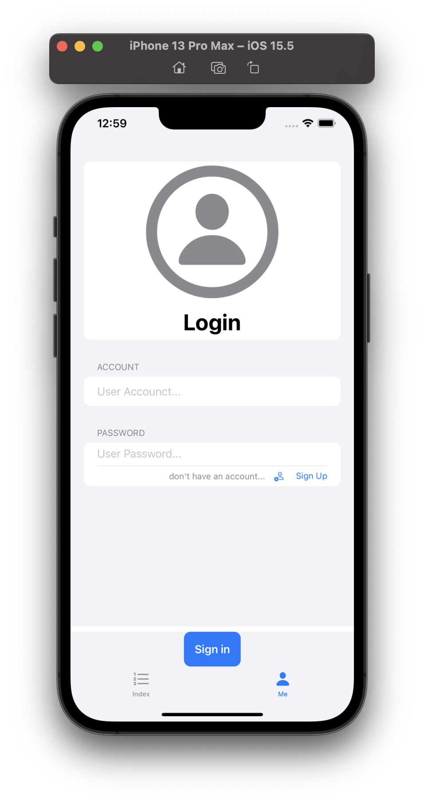
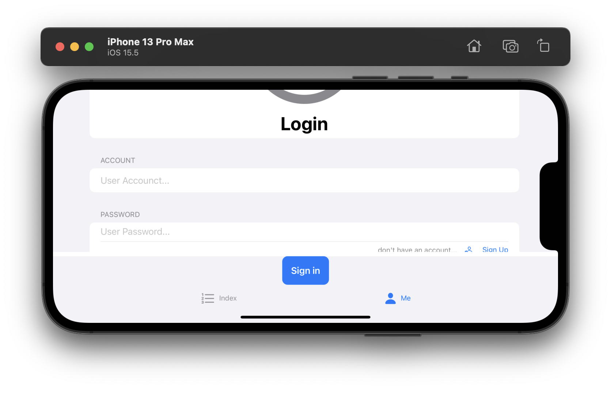

#  GPA Calculator

> Charry Lee Presents

## 1. Overview
It's an app in order to calculate the GPA of students. It contains a main index for calculating and showing information and an account system for identifying the scores from different users.
So you can see the structure of the App. It built with a mode called MVVC. `Model` is the source of data and contains some operations such as CRUD about entity **User** and **Cource**. `Helpers` contains some util class for developers to handle some data such as encrypting and checking the password. `Views` contains views of this app, just like its name.

## 2. Develop Line
This README is **not** an instruction file about this app when is still developing. It's a develop log however.
on July 2, The `SignInView` UI Design finished.

The `SignInView` in portrait mode.

The SignInView in landscape right mode (similar in landscape left mode).

And you can open a sheet window for signing up. ⬆️ 

