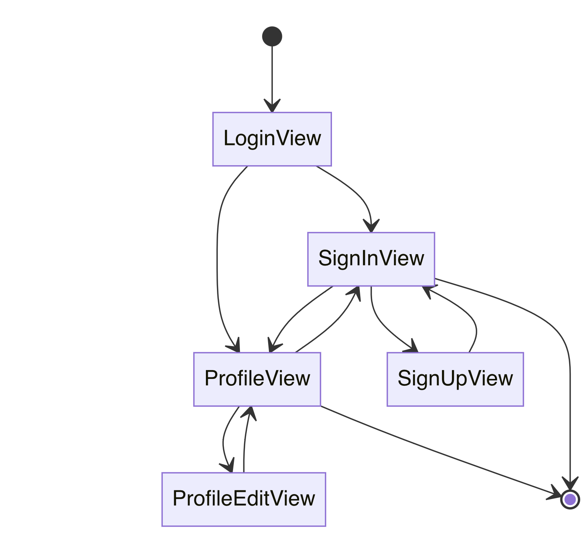

#  GPA Calculator

> Charry Lee Presents

## 1. Overview

It's an app in order to calculate the GPA of students. It contains a main index for calculating and showing information and an account system for identifying the scores from different users.
So you can see the structure of the App. It built with a mode called MVVC. `Model` is the source of data and contains some operations such as CRUD about entity **User** and **Cource**. `Helpers` contains some util class for developers to handle some data such as encrypting and checking the password. `Views` contains views of this app, just like its name.

## 2. Develop Line

This README is **not** an instruction file about this app when is still developing. It's a develop log however.

### July 2, 2022 

The `SignInView` UI Design finished.

The `SignInView` in portrait mode.


The SignInView in landscape right mode (similar in landscape left mode).


And you can open a sheet window for signing up. ⬆️ 


A more important thing: support dark mode


Avatar View finished. Avatar is a designed badge. It can be personalized by changing the `hueRotation` attribute.

Avatar in Phone (bigger mode)


Avatar Personalization Examples


There are two possible ways for users to select their avatars:

1. choose it from several system default avatars (different hueRotations) and store the index (maybe this attribute can be called `avatarindex`);
2. set a picker to set a `hueRotation` to the avatar view and store the `avatarhuerotation` attribute as the avatar of user.

### July 3, 2022
Today's important work is finishinig the UI Design of the `SignUpView`. I choose the way 2 as the final solution to the avatar attribute. And in order to make the page can exit successfully in macOS, I add an `exit` button in the right top corners of the page.

Because this page won't show as a full-screen page (it will presented as a sheet page who is called by the `sign up` button in `SignInView`), I use the `Form` view, the Apple official solution for submitting information, to collect the input from user.

A small point I got: Swift Playground is a good tool for testing the UI performance between Apple platforms.

The main works of this day:

1. Add gender🚹🚺 section in `SignUpView`;

   

2. Add a test class `UserTest` for testing the `ProfileView` without CoreData Model;

3. Update the Core Data Model;

4. Finished the UI design, logic and animation of Login function

   There are two gifs showing what I have done:

   1. Update `SignUpView` animation

      

   2. The animation between `SignInView` and `ProfileView`

      

   The LoginView is the root view container for the login function. It contains `SignInView` and `ProfileView` by using a `ZStack`. The animation between these two views is based on the absolute position in the screen, which means that there are actually two views rendered but just one can be seen by users because there is always one view is located out of the screen whether it is logined or not. It can be applied to all ApplePlatform devices if the offset value is big enough.

   The animation type used in that situation is called spring. The best practice for all platforms is

   * response: 1;
   * dampingFraction: 0.5;
   * blendDuration: 0.5.

   It is tested **OK** for iOS/iPadOS, macOS, watchOS. The situation in tvOS is not for sure.


### July 4, 2022

I have to spend all my time for preparing IELTS.

The Independence Day of the US 🇺🇸

### July 5, 2022
I received my paper book *The Swift Programming Language version 5.7* yesterday and thaught about the animation logic between `SignInView` and `ProfileView`. Maybe there are still some problems in that logic. However, I must stop for several days because of exam. What a difficult test the Speaking part is!!!

Because of re-pademic in Xi'an, My IELTS test is canceled and I decided to take my test one week later. It's the time for me to adding the data model for login function.

What shown at the following are some methods about the login, including utils and CRUDs.

| Method Name | Description                                                  | Parameters                                                   | Returns |
| ----------- | ------------------------------------------------------------ | ------------------------------------------------------------ | ------- |
| MD5         | Convey the plainMessage to MD5 Hash Value (not a very safe way although) | plainMessage: String                                         | String  |
| save        | Save the entity object to your Core Data Model               | context: NSManagedObjectContext                              | Void    |
| addUser     | Add the new user to your Core Data Model                     | userName, userAccount, userPassword: String; userAvatar: Double; userGender: Int; context: NSManagedObjectContext | Void    |
| editUser    | Edit the existed user to your Core Data Model                | user: User; userName, userPassword, userDescription: String; userAvatar: Double; userGender: Int; context: NSManagedObjectContext | Void    |
| checkUser   | Check whether the user exists in your Core Data Model by matching the userAccount | userAccount: String                                          | Bool    |
| selectUser  | Select the required user from the whole Core Data Model by matching the userAccount and userPassword | userAccount: String; userPassword: String                    | User?   |
| signin      | Try signing in by using the account and password provided by users | Void                                                         | Void    |
| signup      | Create a new account by using the account and password provided by users | Void                                                         | Void    |

Potential dangers: Can't request specified recordings or just some attributes of the entity, but only the whole entire recordings.

### July 6, 2022

Source of truth and data in the views that possibly used:

* `LoginView`:

  * ```swift
        @State var user: FetchedResults<User>.Element?
    ```

    used to store the logined user ("Me")

* `SignInView`:

  * ```swift
        @FetchRequest(sortDescriptors: [SortDescriptor(\.useravatar, order: .reverse)]) var users: FetchedResults<User>
        @Binding var signeduser: FetchedResults<User>.Element?
    ```

    users are all the user recordings in the database and `signeduser` is blinded to the `user` in the `LoginView` 

  * ```swift
        @State var isSignUp: Bool = false
        @State var isFailSignUp: Bool = false
    ```

    These two State variables are used to tell whether sign in process is executed successfully

* `SignUpView`:

  * ```swift
        @Binding var isSignUp: Bool
    ```

    It is blinded to the same name State variable in the `SignInView`

  * ```swift
    		@State var isSucceessSignUP: Bool = false
        @State var isFailedSignUP: Bool = false
    ```

    Thery're used to tell whether sign up process is execuded successfully

* `ProfileView`:

  * ```swift
    		@Binding var isLogined: Bool
    ```

    It's blinded to the same name variable in `LoginView`.

* `ProfileEditView`:

  * ```swift
    		@Binding var isEdit: Bool
    ```

    It's blinded to the same variable in `ProfileView`.

The designed state flow diagram is the following.



🎉 At this time, it can say that "Login function has been done already"

Potential features that needs further development:

* Account Delete Function, which is very important for user's rights and privacy;
* Choose Avatar from Image, not just change the color of the `Avatar`;

### July 7, 2022
It seems that the IELTS on July 10, 2022 is not canceled. Great!

The only work I do today is improving the encrypt method from MD5 to SHA256, which is a more safe way for data security.
