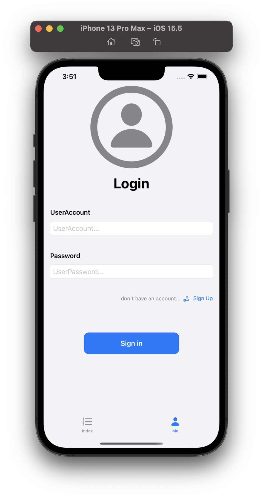

#  GPA Calculator

> Charry Lee Presents

## 1. Overview

It's an app in order to calculate the GPA of students. It contains a main index for calculating and showing information and an account system for identifying the scores from different users.
So you can see the structure of the App. It built with a mode called MVVC. `Model` is the source of data and contains some operations such as CRUD about entity **User** and **Cource**. `Helpers` contains some util class for developers to handle some data such as encrypting and checking the password. `Views` contains views of this app, just like its name.

## 2. Develop Line

This README is **not** an instruction file about this app when is still developing. It's a develop log however.

### July 2, 2022 

The `SignInView` UI Design finished.

The `SignInView` in portrait mode.

The SignInView in landscape right mode (similar in landscape left mode).

And you can open a sheet window for signing up. ⬆️ 

A more important thing: support dark mode

Avatar View finished. Avatar is a designed badge. It can be personalized by changing the `hueRotation` attribute.

Avatar in Phone (bigger mode)

Avatar Personalization Examples

There are two possible ways for users to select their avatars:

1. choose it from several system default avatars (different hueRotations) and store the index (maybe this attribute can be called `avatarindex`);
2. set a picker to set a `hueRotation` to the avatar view and store the `avatarhuerotation` attribute as the avatar of user.

### July 3, 2022
Today's important work is finishinig the UI Design of the `SignUpView`. I choose the way 2 as the final solution to the avatar attribute. And in order to make the page can exit successfully in macOS, I add an `exit` button in the right top corners of the page.

Because this page won't show as a full-screen page (it will presented as a sheet page who is called by the `sign up` button in `SignInView`), I use the `Form` view, the Apple official solution for submitting information, to collect the input from user.

A small point I got: Swift Playground is a good tool for testing the UI performance between Apple platforms.

The main works of this day:

1. Add gender🚹🚺 section in `SignUpView`;

   

2. Add a test class `UserTest` for testing the `ProfileView` without CoreData Model;

3. 
